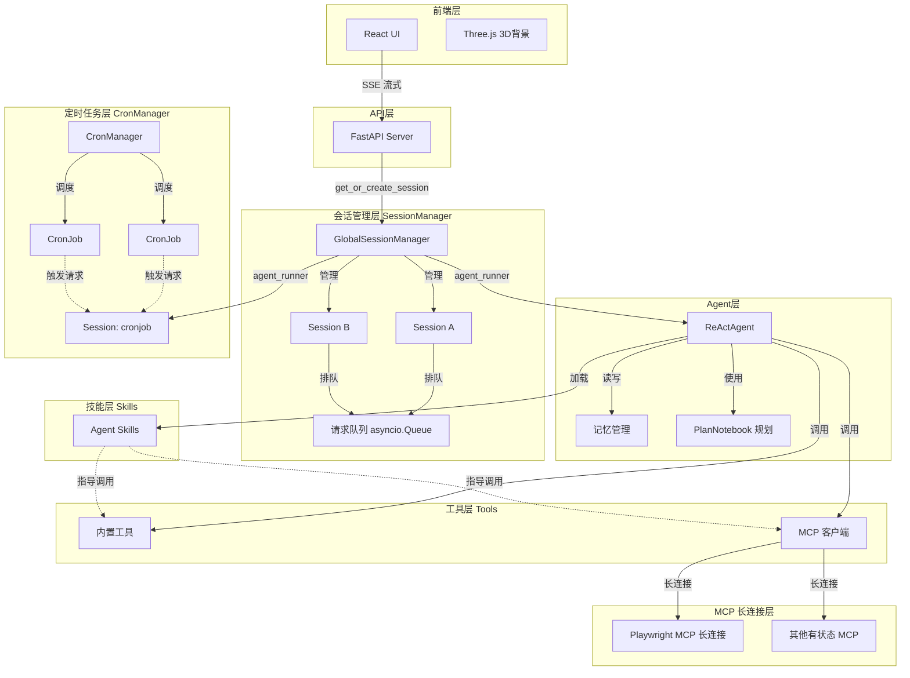

# AgentScope 智能聊天助手


## 1. 技术栈

| 层级 | 技术 |
|------|------|
| 前端 | React 18 + Three.js (3D背景) |
| 后端 | FastAPI + AgentScope |
| AI 模型 | Qwen3-Max / Qwen3.5-Plus (DashScope) |
| 工具集成 | MCP (Model Context Protocol) |
| 会话存储 | JSON 文件持久化 |

## 2. 关键特性

- **ReAct 智能推理**：基于 AgentScope 的 ReActAgent 实现多步推理和工具调用
- **实时流式响应**：SSE 流式传输，支持打字机效果
- **多请求排队**：同一会话支持多个请求排队，自动顺序执行
- **真打断机制**：基于 request_id 的精准打断，可终止指定 SSE 请求
- **MCP 长连接**：有状态 MCP 客户端保持长连接，支持 Playwright 浏览器等
- **定时任务调度**：CronManager 统一管理定时任务，所有任务提交到专用 "cronjob" session 执行
- **工具调用生态**：
  - 内置工具：文件操作、Shell 命令、联网搜索、定时任务管理
  - MCP 集成：Playwright 浏览器、八字算命等外部服务
- **会话管理**：多会话隔离，支持长文本压缩和记忆恢复
- **深度研究模式**：Agentic Planning 支持复杂任务拆解
- **技能插件系统**：可扩展的 Skill 架构，Skill 指导 Tool 调用

## 3. 技术架构图



## 4. 运行方法

### 环境准备

**Python 版本要求**：建议使用 Python 3.12 或以上版本（3.10 存在 asyncio bug [#45416](https://bugs.python.org/issue45416)）

```bash
# 1. 安装依赖
pip install -r requirements.txt

# 2. 配置环境变量
# 创建 .env 文件，填入：
DASHSCOPE_API_KEY=your_api_key_here
```

### 启动服务

```bash
# 启动后端服务
python server.py
```

服务启动后，访问 http://localhost:8000 即可使用。

### 内置工具列表

| 工具名称 | 功能描述 | 启用状态 |
|---------|---------|---------|
| view_text_file | 查看文本文件内容 | 默认启用 |
| write_text_file | 写入文本文件 | 默认启用 |
| insert_text_file | 在指定位置插入文本 | 默认启用 |
| execute_shell_command | 执行 Shell 命令 | 默认启用 |
| web_search | 联网搜索（支持图文混排） | 默认启用 |
| add_cron | 添加定时任务 | 默认启用 |
| del_cron | 删除定时任务 | 默认启用 |
| list_crons | 列出定时任务 | 默认启用 |
| subagent | 子代理委托 | 默认启用 |

### 内置技能列表

| 技能名称 | 功能描述 |
|---------|---------|
| find-skills | 帮助用户发现和安装 Agent Skills，支持通过 `npx skills` 命令搜索和安装社区技能 |
| python-code-review | Python 代码审查，检查类型安全、异步模式、错误处理和常见错误 |
| xlsx | Excel 文件处理，支持创建、编辑、分析 .xlsx/.csv 文件，包含公式重算和格式规范 |

### MCP 集成

| MCP 名称 | 类型 | 功能描述 |
|---------|------|---------|
| Playwright-MCP | 有状态/stdio | 浏览器自动化控制 |
| Bazi-MCP | 无状态/SSE | 八字算命服务 |

### 项目结构

```
.
├── server.py           # FastAPI 主服务
├── superagent.py       # Agent 核心逻辑
├── tools.py            # 工具函数
├── model.py            # 模型定义
├── datamodel.py        # 数据模型
├── session.py          # 会话管理
├── cron_manager.py     # 定时任务管理
├── chat.html           # 前端页面
├── assets/
│   └── image/          # 图片资源
└── .agents/skills/     # 技能插件目录
    ├── find-skills/
    ├── python-code-review/
    └── xlsx/
```
