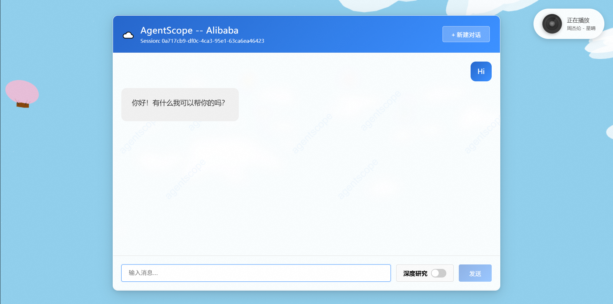
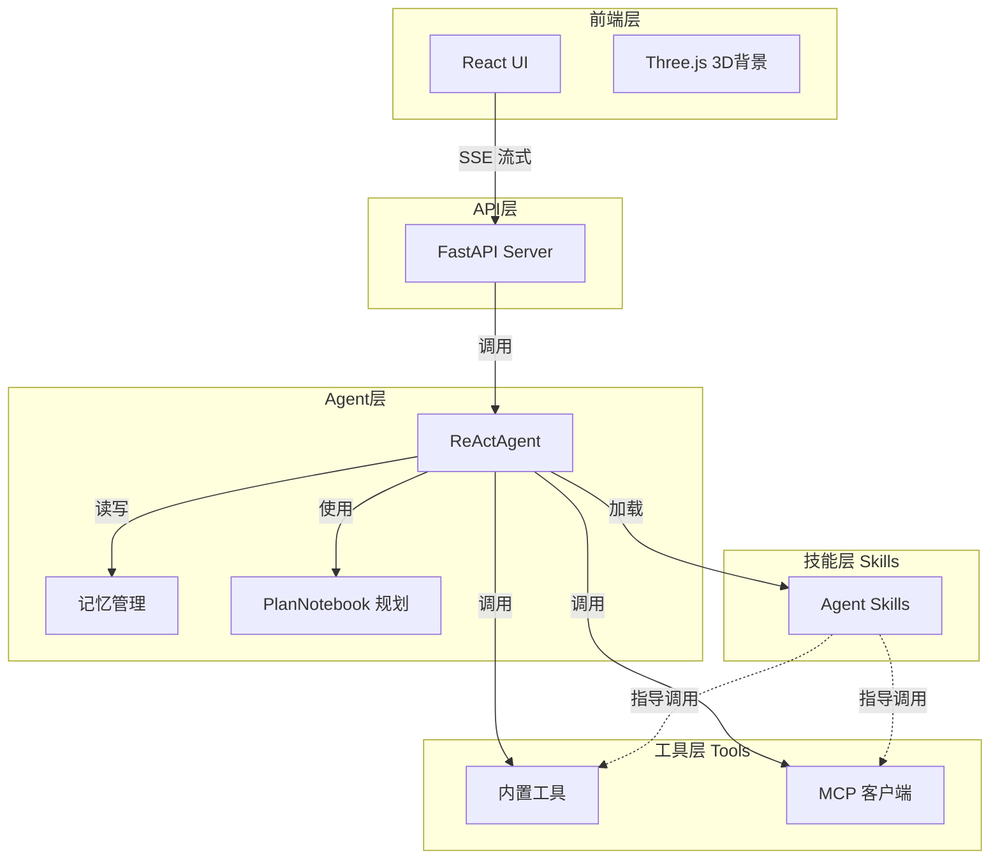

# AgentScope 智能聊天助手



## 1. 技术栈

| 层级 | 技术 |
|------|------|
| 前端 | React 18 + Three.js (3D背景) |
| 后端 | FastAPI + AgentScope |
| AI 模型 | Qwen3-Max / Qwen3.5-Plus (DashScope) |
| 工具集成 | MCP (Model Context Protocol) |
| 会话存储 | JSON 文件持久化 |

## 2. 关键特性

- **ReAct 智能推理**：基于 AgentScope 的 ReActAgent 实现多步推理和工具调用
- **实时流式响应**：SSE 流式传输，支持打字机效果
- **多请求排队**：同一会话支持多个请求排队，自动顺序执行
- **真打断机制**：基于 request_id 的精准打断，可终止指定 SSE 请求
- **工具调用生态**：
  - 内置工具：文件操作、Shell 命令、联网搜索
  - MCP 集成：Playwright 浏览器、八字算命等外部服务
- **会话管理**：多会话隔离，支持长文本压缩和记忆恢复
- **深度研究模式**：Agentic Planning 支持复杂任务拆解
- **技能插件系统**：可扩展的 Skill 架构，Skill 指导 Tool 调用

## 3. 技术架构图



## 4. 运行方法

### 环境准备

```bash
# 1. 安装依赖
pip install -r requirements.txt

# 2. 配置环境变量
# 创建 .env 文件，填入：
DASHSCOPE_API_KEY=your_api_key_here
```

### 启动服务

```bash
# 启动后端服务
python server.py
```

服务启动后，访问 http://localhost:8000 即可使用。

### 项目结构

```
.
├── server.py           # FastAPI 主服务
├── superagent.py       # Agent 核心逻辑
├── tools.py            # 工具函数
├── model.py            # 模型定义
├── datamodel.py        # 数据模型
├── session.py          # 会话管理
├── chat.html           # 前端页面
├── assets/
│   └── image/          # 图片资源
└── .agents/skills/     # 技能插件目录
    ├── find-skills/
    ├── python-code-review/
    └── xlsx/
```
