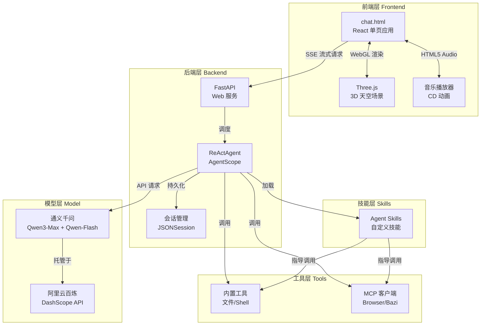
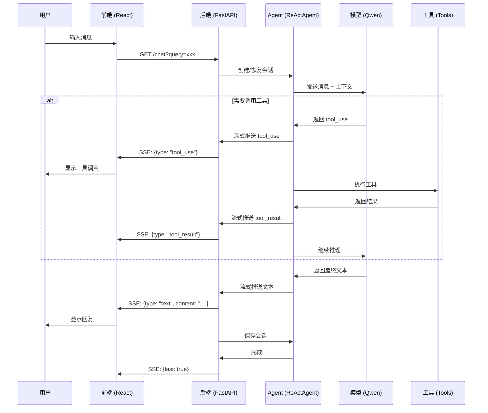

# AgentScope -- Alibaba 🎈

基于 [AgentScope](https://github.com/modelscope/agentscope) 和 FastAPI 构建的炫酷智能聊天助手，配备 3D 天空背景、音乐播放、实时计划展示等特性。


## ✨ 特性亮点

### 🎨 炫酷 UI
- **3D 天空背景**：Three.js 渲染的动态天空场景
  - 30朵蓬松白云缓缓飘动
  - 10个彩色热气球悠闲漂浮
  - 2架逼真飞机飞过天际
  - 相机浮动模拟飞行视角
- **CD 音乐播放器**：右上角旋转的 CD 动画，播放周杰伦《星晴》
- **立体聊天框**：多层阴影 + 毛玻璃效果
- **阿里云蓝色主题**：清爽的科技风格
- **实时计划面板**：右侧渐变色气泡展示任务执行状态

### 🤖 智能对话
- **ReAct Agent**：基于通义千问 Qwen3-Max（主模型）+ Qwen-Flash（压缩模型）
- **智能规划**：支持 Agentic Planning，分步骤执行复杂任务
- **工具调用**：文件操作、浏览器自动化（可选）
- **MCP 协议**：支持 Stateful/Stateless MCP 客户端集成（可选）
- **流式响应**：SSE 实时推送，支持工具调用和结果展示

### 💾 会话管理
- **多会话支持**：UUID 隔离，自动持久化到 `sessions/` 目录
- **上下文缓存**：阿里云百炼 ephemeral cache，优化长对话性能
- **智能压缩**：超过 20万字符自动压缩，保留最近 5 轮对话

## 🏗️ 系统架构



## 📦 安装与启动

### 1. 环境要求
- Python 3.8+
- Node.js（可选，用于本地开发）
- 阿里云 DashScope API Key

### 2. 安装依赖

```bash
pip install -r requirements.txt
```

或手动安装：
```bash
pip install agentscope fastapi uvicorn
```

### 3. 配置环境变量

**必需环境变量**：
```bash
export DASHSCOPE_API_KEY="your_dashscope_api_key"
```

**可选环境变量**（仅在启用相关功能时需要）：
```bash
export AGENTRUN_BROWSER_API_KEY="your_browser_api_key"  # 启用浏览器自动化时需要
```

### 4. 启动服务

```bash
python superagent.py
```

服务将在 `http://127.0.0.1:8000` 启动。

### 5. 访问聊天页面

在浏览器中打开：
```
http://127.0.0.1:8000/
```

**首次播放音乐**：点击页面任意位置激活音频播放（浏览器自动播放策略要求）

## 🎯 核心架构原理

### 1. 前端架构

#### 1.1 React 单页应用
- **状态管理**：React Hooks (useState, useRef, useEffect)
- **消息渲染**：支持 Markdown 格式，工具调用折叠展示
- **自动滚动**：流式消息到达时自动滚动到底部，用户手动滚动后暂停
- **计划面板**：独立的右侧面板展示任务分解和执行状态

#### 1.2 Three.js 3D 场景
```javascript
场景组成：
- 场景 (Scene)：天空蓝色背景 #87CEEB
- 相机 (PerspectiveCamera)：75° FOV，上下浮动动画
- 渲染器 (WebGLRenderer)：全屏 Canvas，抗锯齿

动画元素：
- 云朵 (30个)：多球体组合，不规则形状，透明度 0.7-0.9，向前飘动
- 热气球 (10个)：球体气囊 + 方块篮子 + 绳索，缓慢上升和旋转
- 飞机 (2架)：流线型机身 + 机翼 + 尾翼 + 引擎，俯仰摇摆飞行
- 粒子 (100个)：白色小点，轻微旋转

动画循环：
requestAnimationFrame() 60fps 渲染
- 云朵：position.z += 0.05，超出 10 重置到 -100
- 热气球：正弦波上下浮动 + 缓慢旋转
- 飞机：左右飞行 + 上下起伏 + 倾斜摇摆
- 相机：Math.sin(time) * 0.3 上下浮动
```

#### 1.3 音乐播放系统
- **本地托管**：`/music/jay-xingqing.mp4` 通过 FastAPI 静态路由暴露
- **CD 动画**：CSS `@keyframes rotate` 4秒一圈匀速旋转
- **视觉效果**：黑色渐变 + 内环 + 光泽条纹（conic-gradient）
- **用户交互**：首次点击页面后触发 `audio.play()`

### 2. 后端架构

#### 2.1 FastAPI 服务层
```python
主要路由：
- GET /             → 返回 chat.html
- GET /chat         → SSE 流式聊天接口
- GET /music/{filename} → 音乐文件服务

中间件：
- CORS：允许所有来源（生产环境需限制）
- 流式响应：StreamingResponse with SSE 格式
```

#### 2.2 AgentScope ReActAgent
```python
核心组件：
- 模型：Qwen3-Max (主模型) + Qwen-Flash (压缩模型)
- 内存：InMemoryMemory (短期对话记忆)
- 会话：JSONSession (持久化到 sessions/)
- 工具：Toolkit (统一管理所有工具)

执行流程：
1. 接收用户消息
2. 模型推理 → 生成计划或调用工具
3. 执行工具 → 返回结果
4. 继续推理 → 生成最终回复
5. 流式推送每一步到前端
```

#### 2.3 Planning 机制
```python
当 deepresearch=True 时启用：

1. PlanNotebook 创建计划
   - 分解任务为多个子任务
   - 每个子任务有状态：todo/in_progress/done/abandoned

2. 流式推送计划状态
   - 每次状态更新都推送到前端
   - 前端实时渲染计划面板

3. 子任务执行
   - 按顺序或并行执行子任务
   - 每个子任务结束后更新状态
```

#### 2.4 工具调用与结果展示
```python
工具调用流程：
1. Agent 决定调用工具 (tool_use)
   - type: "tool_use"
   - tool_use_id: UUID
   - content: "tool_name: {...args}"

2. 工具执行并返回结果 (tool_result)
   - type: "tool_result"
   - tool_use_id: 对应的 tool_use ID
   - content: 执行结果

前端展示：
- tool_use：可点击展开/折叠
- tool_result：通过 tool_use_id 跨消息匹配并关联显示
- 默认折叠，点击 tool_use 展开对应的 tool_result
```

#### 2.5 MCP 客户端管理
```python
StatefulMCPManager：
- 维护 session_id → MCP 客户端映射
- 5分钟无活动自动释放连接
- 支持 streamable_http 和 sse 两种传输协议

客户端类型：
- HttpStatelessClient：无状态，每次请求独立
- StatefulMCPClient：有状态，保持 WebSocket/SSE 连接
```

### 3. 数据流



### 4. 关键技术细节

#### 4.1 流式响应格式
```json
{
  "msg_id": "message_uuid",
  "last": false,
  "contents": [
    {
      "type": "text",
      "content": "文本内容"
    },
    {
      "type": "tool_use",
      "tool_use_id": "tool_uuid",
      "content": "view_text_file: {\"file_path\": \"test.txt\"}"
    },
    {
      "type": "tool_result",
      "tool_use_id": "tool_uuid",
      "content": "view_text_file: \"文件内容...\""
    }
  ],
  "plan": {
    "name": "任务名称",
    "description": "任务描述",
    "subtasks": [
      {
        "name": "子任务1",
        "description": "描述",
        "state": "done"
      }
    ]
  }
}
```

#### 4.2 上下文缓存优化
```python
# 阿里云百炼上下文缓存
msg['content'][-1]['cache_control'] = {"type": "ephemeral"}

优点：
- 减少重复计算开销
- 加速长对话响应
- 降低 API 成本
```

#### 4.3 消息压缩策略
```python
触发条件：上下文超过 200,000 字符
压缩方式：保留最近 5 轮对话，丢弃旧消息
压缩模型：Qwen-Flash（快速且成本低）
实现：ReActAgent.CompressionConfig
```

## 📁 项目结构

```
as/
├── superagent.py          # FastAPI 后端 + Agent 核心逻辑
├── chat.html              # React 前端 + Three.js 3D 场景
├── mcp_session.py         # MCP 客户端会话管理
├── music/                 # 音乐文件目录
│   └── jay-xingqing.mp4   # 周杰伦《星晴》
├── .agents/skills/        # Agent 技能
│   ├── find-skills/       # 技能查找
│   ├── python-code-review/# Python 代码审查
│   └── xlsx/              # Excel 处理
├── sessions/              # 会话持久化 (自动生成)
├── image.png              # 效果展示图
├── requirements.txt       # Python 依赖
├── .gitignore
└── README.md
```

## 🔧 配置与扩展

### 开关配置
在 `superagent.py` 中调整功能开关：
```python
FLAGS = {
    "enable_browser_mcp": False,       # 浏览器自动化 (需要 AGENTRUN_BROWSER_API_KEY)
    "enable_bazi_mcp": False,          # 八字算命 MCP
    "enable_websearch": True,          # 网页搜索工具
    "enable_view_text_file": True,     # 文件读取
    "enable_write_text_file": True,    # 文件写入
    "enable_insert_text_file": True,   # 文件插入
    "enable_execute_shell_command": True,  # Shell 命令
    "enable_subagent": True,           # 子代理
}
```

### 添加自定义工具
```python
from agentscope.tool import register_tool

@register_tool
def my_custom_tool(arg1: str, arg2: int) -> str:
    """
    工具描述
    
    Args:
        arg1: 参数1描述
        arg2: 参数2描述
    
    Returns:
        返回值描述
    """
    return f"Result: {arg1} * {arg2}"

# 注册到 Toolkit
toolkit.register_tool(my_custom_tool)
```

### 创建自定义 Skill
在 `skills/` 目录下创建新技能：
```markdown
---
name: your-skill-name
description: 技能描述
---

# 执行步骤
- 步骤 1
- 步骤 2
- 步骤 3
```

## 🎨 UI 定制

### 修改颜色主题
在 `chat.html` 中搜索并替换颜色值：
- 主色调蓝色：`#1890ff` → 你的颜色
- 天空背景：`#87CEEB` → 你的颜色
- 聊天框背景：`rgba(255, 255, 255, 0.95)` → 你的颜色

### 修改 3D 场景
调整 Three.js 参数：
```javascript
// 云朵数量
for (let i = 0; i < 30; i++) { ... }

// 热气球数量
for (let i = 0; i < 10; i++) { ... }

// 飞机数量
for (let i = 0; i < 2; i++) { ... }

// 动画速度
cloud.position.z += 0.05;  // 云朵速度
```

## 📝 API 文档

### GET /chat
**描述**：流式聊天接口

**参数**：
- `session_id` (string, required): 会话 UUID
- `query` (string, required): 用户消息
- `deepresearch` (boolean, optional): 是否启用深度研究模式（Planning）

**响应**：SSE 流，每条消息格式见上文

### GET /music/{filename}
**描述**：音乐文件服务

**参数**：
- `filename` (string, required): 音乐文件名

**响应**：音频文件流 (audio/mp4)

## 🐛 常见问题

### 1. 音乐不播放
**原因**：浏览器自动播放策略限制
**解决**：点击页面任意位置激活音频

### 2. 3D 场景卡顿
**原因**：性能不足或对象过多
**解决**：减少云朵/热气球数量，降低粒子数

### 3. SSE 连接断开
**原因**：网络不稳定或超时
**解决**：刷新页面重新连接

### 4. 工具调用失败
**原因**：权限不足或环境变量未配置
**解决**：检查 API Key 配置，调整 FLAGS 开关

## 📄 许可证

本项目仅供学习和研究使用。

## 🙏 致谢

- [AgentScope](https://github.com/modelscope/agentscope) - 强大的 Agent 框架
- [阿里云百炼](https://www.aliyun.com/product/bailian) - 大模型服务
- [Three.js](https://threejs.org/) - 3D 图形库
- [FastAPI](https://fastapi.tiangolo.com/) - 现代 Web 框架

## 📧 联系方式

**Author**: OwenLiang  
**Date**: 2026-02

---

**Enjoy the Flight! 🎈✈️☁️**
