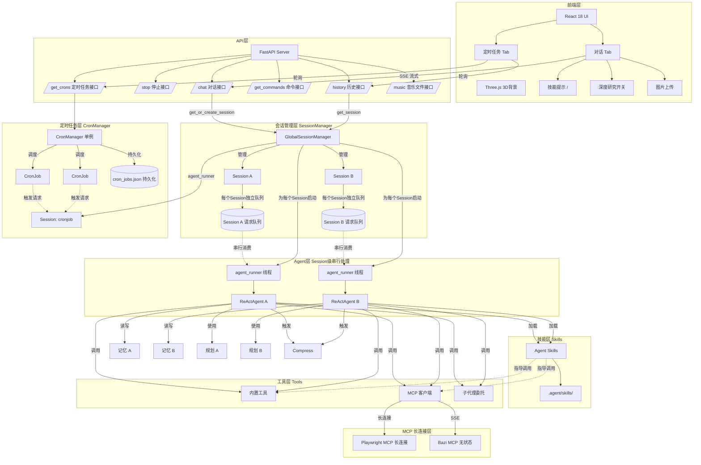

# AgentScope 小龙虾

[](https://github.com/owenliang/openclaw)
[](https://space.bilibili.com/288748846)

## 界面预览

### 对话界面
支持技能提示（输入 `/` 触发）、深度研究模式、图片上传、实时计划展示等功能。


### 定时任务管理
独立的定时任务 Tab，实时查看任务列表和执行历史，支持秒级精度的 Cron 表达式。


### 深度研究模式
Agentic Planning 支持复杂任务拆解，可视化展示计划进度和子任务状态。


### 多模态对话
支持图片上传（粘贴/选择），基于 **Qwen3.5-Plus** 多模态能力进行图像理解和对话。


## 1. 技术栈

| 层级 | 技术 |
|------|------|
| 前端 | React 18 + Three.js (3D背景) |
| 后端 | FastAPI + AgentScope |
| AI 模型 | Qwen3.5-Plus (DashScope) - 支持多模态理解 |
| 工具集成 | MCP (Model Context Protocol) |
| 会话存储 | JSON 文件持久化 |

## 2. 关键特性

- **ReAct 智能推理**：基于 AgentScope 的 ReActAgent 实现多步推理和工具调用
- **实时流式响应**：SSE 流式传输，支持打字机效果
- **多请求排队**：同一会话支持多个请求排队，自动顺序执行
- **真打断机制**：基于 request_id 的精准打断，可终止指定 SSE 请求
- **MCP 长连接**：有状态 MCP 客户端保持长连接，支持 Playwright 浏览器等
- **定时任务调度**：CronManager 统一管理定时任务，所有任务提交到专用 "cronjob" session 执行
- **工具调用生态**：
  - 内置工具：文件操作、Shell 命令、联网搜索、定时任务管理、子代理委托
  - MCP 集成：Playwright 浏览器、八字算命等外部服务
- **会话管理**：多会话隔离，支持长文本压缩和记忆恢复
- **深度研究模式**：Agentic Planning 支持复杂任务拆解，可视化计划进度
- **技能插件系统**：可扩展的 Skill 架构，输入 `/` 触发技能提示，Skill 指导 Tool 调用
- **图片上传支持**：支持粘贴/选择图片进行多模态对话
- **智能滚动**：对话自动滚动到底部，用户向上滚动时暂停自动跟随

## 3. 技术架构图


```mermaid
graph TB
    subgraph "前端层"
        UI[React 18 UI]
        ThreeJS[Three.js 3D背景]
        TabChat[对话 Tab]
        TabCron[定时任务 Tab]
        SkillHint[技能提示 /]
        DeepResearch[深度研究开关]
        ImgUpload[图片上传]
        UI --> TabChat
        UI --> TabCron
        TabChat --> SkillHint
        TabChat --> DeepResearch
        TabChat --> ImgUpload
    end

    subgraph "API层"
        FastAPI[FastAPI Server]
        ChatEP[/chat 对话接口/]
        StopEP[/stop 停止接口/]
        HistoryEP[/history 历史接口/]
        CommandsEP[/get_commands 命令接口/]
        CronsEP[/get_crons 定时任务接口/]
        MusicEP[/music 音乐文件接口/]
        FastAPI --> ChatEP
        FastAPI --> StopEP
        FastAPI --> HistoryEP
        FastAPI --> CommandsEP
        FastAPI --> CronsEP
        FastAPI --> MusicEP
    end

    subgraph "会话管理层 SessionManager"
        SessionMgr[GlobalSessionManager]
        Session1[Session A]
        Session2[Session B]
        Session1Queue[(Session A 请求队列)]
        Session2Queue[(Session B 请求队列)]
        SessionMgr -->|管理| Session1
        SessionMgr -->|管理| Session2
        Session1 -->|每个Session独立队列| Session1Queue
        Session2 -->|每个Session独立队列| Session2Queue
    end

    subgraph "Agent层 Session级串行处理"
        Runner1[agent_runner 线程]
        Runner2[agent_runner 线程]
        ReAct1[ReActAgent A]
        ReAct2[ReActAgent B]
        Session1Queue -.->|串行消费| Runner1
        Session2Queue -.->|串行消费| Runner2
        Runner1 --> ReAct1
        Runner2 --> ReAct2
    end

    subgraph "技能层 Skills"
        Skills[Agent Skills]
        SkillDir[.agent/skills/]
        Skills --> SkillDir
    end

    subgraph "工具层 Tools"
        BuiltIn[内置工具]
        MCP[MCP 客户端]
        SubAgent[子代理委托]
    end

    subgraph "MCP 长连接层"
        MCPState1[Playwright MCP 长连接]
        MCPState2[Bazi MCP 无状态]
    end

    subgraph "定时任务层 CronManager"
        CronMgr[CronManager 单例]
        CronJob1[CronJob]
        CronJob2[CronJob]
        CronSession[Session: cronjob]
        CronPersistence[(cron_jobs.json 持久化)]
        CronMgr -->|调度| CronJob1
        CronMgr -->|调度| CronJob2
        CronMgr -->|持久化| CronPersistence
        CronJob1 -.->|触发请求| CronSession
        CronJob2 -.->|触发请求| CronSession
    end

    TabChat -->|SSE 流式| ChatEP
    TabCron -->|轮询| HistoryEP
    TabCron -->|轮询| CronsEP
    ChatEP -->|get_or_create_session| SessionMgr
    HistoryEP -->|get_session| SessionMgr
    CronsEP --> CronMgr
    SessionMgr -->|为每个Session启动| Runner1
    SessionMgr -->|为每个Session启动| Runner2
    SessionMgr -->|agent_runner| CronSession
    ReAct1 -->|加载| Skills
    ReAct2 -->|加载| Skills
    ReAct1 -->|调用| BuiltIn
    ReAct2 -->|调用| BuiltIn
    ReAct1 -->|调用| MCP
    ReAct2 -->|调用| MCP
    ReAct1 -->|调用| SubAgent
    ReAct2 -->|调用| SubAgent
    Skills -.->|指导调用| BuiltIn
    Skills -.->|指导调用| MCP
    ReAct1 -->|读写| Memory1[记忆 A]
    ReAct2 -->|读写| Memory2[记忆 B]
    ReAct1 -->|使用| Plan1[规划 A]
    ReAct2 -->|使用| Plan2[规划 B]
    ReAct1 -->|触发| Compress
    ReAct2 -->|触发| Compress
    MCP -->|长连接| MCPState1
    MCP -->|SSE| MCPState2
```

## 4. 定时任务功能

AgentScope 内置完整的定时任务调度系统，通过 `CronManager` 单例统一管理所有定时任务。

### 4.1 功能特性

| 特性 | 说明 |
|------|------|
| **秒级精度** | 支持 6 字段 cron 表达式（秒 分 时 日 月 周） |
| **持久化存储** | 任务自动保存到 `jobs.json`，重启后自动恢复 |
| **隔离执行** | 所有定时任务在专用 `cronjob` session 中执行 |
| **实时观察** | 前端「定时任务」Tab 实时查看执行历史和对话内容 |
| **自动滚动** | 新消息自动滚动到底部，支持手动回滚查看历史 |

### 4.2 Cron 表达式格式

支持标准 5 字段和扩展 6 字段格式：

| 格式 | 示例 | 说明 |
|------|------|------|
| 6 字段 | `*/30 * * * * *` | 每 30 秒执行 |
| 6 字段 | `0 */5 * * * *` | 每 5 分钟执行（整秒） |
| 5 字段 | `*/5 * * * *` | 每 5 分钟执行 |
| 特殊表达式 | `@hourly` | 每小时执行 |
| 特殊表达式 | `@daily` | 每天执行 |

### 4.3 相关工具

| 工具名称 | 功能 |
|---------|------|
| `add_cron` | 添加定时任务，支持秒级精度 |
| `del_cron` | 删除指定定时任务 |
| `list_crons` | 列出所有定时任务 |

## 5. 运行方法

### 环境准备

**Python 版本要求**：建议使用 Python 3.12 或以上版本（3.10 存在 asyncio bug [#45416](https://bugs.python.org/issue45416)）

```bash
# 1. 安装依赖
pip install -r requirements.txt

# 2. 配置环境变量
# 创建 .env 文件，填入：
DASHSCOPE_API_KEY=your_api_key_here

# 可选：启用 API 鉴权（默认关闭）
SERVER_API_AUTH=true
SERVER_API_TOKEN=your_secret_token
```

**API 鉴权说明**：
- 不设置 `SERVER_API_AUTH` 或设置为 `false` 时，默认不启用鉴权
- 设置 `SERVER_API_AUTH=true` 后，所有 API 接口需要携带 `Authorization: Bearer <token>` 请求头
- Token 值由 `SERVER_API_TOKEN` 环境变量指定
- 未携带或错误的 Token 将返回 401/403 状态码

### 启动服务

```bash
# 启动后端服务
python server.py
```

服务启动后，访问 http://localhost:8000 即可使用。

### 内置工具列表

| 工具名称 | 功能描述 | 启用状态 |
|---------|---------|---------|
| view_text_file | 查看文本文件内容 | 默认启用 |
| write_text_file | 写入文本文件 | 默认启用 |
| insert_text_file | 在指定位置插入文本 | 默认启用 |
| execute_shell_command | 执行 Shell 命令 | 默认启用 |
| web_search | 联网搜索（支持图文混排、时间感知） | 默认启用 |
| add_cron | 添加定时任务（支持秒级精度） | 默认启用 |
| del_cron | 删除定时任务 | 默认启用 |
| list_crons | 列出所有定时任务 | 默认启用 |
| subagent | 子代理委托（复杂任务独立执行） | 默认启用 |

### 内置技能列表

| 技能名称 | 目录 | 功能描述 |
|---------|------|---------|
| find-skills | .agent/skills/find-skills/ | 帮助用户发现和安装 Agent Skills，支持通过 `npx skills` 命令搜索和安装社区技能 |
| skill-creator | .agent/skills/skill-creator/ | 创建新技能、修改和优化现有技能，支持技能性能评估和描述优化 |

### MCP 集成

| MCP 名称 | 类型 | 传输协议 | 功能描述 |
|---------|------|---------|---------|
| Playwright-MCP | 有状态 | stdio | 浏览器自动化控制，支持页面操作、截图、数据提取 |
| Bazi-MCP | 无状态 | SSE | 八字算命服务，基于出生日期时辰的命理分析 |

### API 接口列表

| 接口路径 | 方法 | 功能描述 |
|---------|------|---------|
| `/` | GET | 主页，返回 chat.html |
| `/chat` | POST | 对话接口，SSE 流式返回，支持深度研究模式 |
| `/stop` | GET | 停止指定请求（基于 request_id 精准打断） |
| `/history` | GET | 获取会话历史记录 |
| `/get_commands` | GET | 获取可用命令/技能列表 |
| `/get_crons` | GET | 获取定时任务列表 |
| `/music/{filename}` | GET | 音乐文件服务 |

### 接口返回值样例

#### POST /chat - 对话接口（SSE 流式）

**请求体：**
```json
{
  "session_id": "user-session-001",
  "content": [{"type": "text", "text": "你好"}],
  "deepresearch": false
}
```

**SSE 流式响应：**
```
data: {"request_id": "550e8400-e29b-41d4-a716-446655440000"}

data: {"msg_id": "msg-001", "last": false, "contents": [{"type": "text", "content": "你好"}], "plan": null}

data: {"msg_id": "msg-001", "last": false, "contents": [{"type": "text", "content": "你好！有什么可以帮助你的吗？"}], "plan": null}

data: {"msg_id": "msg-001", "last": true, "contents": [{"type": "text", "content": "你好！有什么可以帮助你的吗？"}], "plan": null}
```

**深度研究模式 plan 字段示例：**
```json
{
  "msg_id": "msg-002",
  "last": false,
  "contents": [...],
  "plan": {
    "name": "数据分析任务",
    "description": "分析销售数据并生成报告",
    "subtasks": [
      {"name": "读取数据文件", "description": "从CSV加载数据", "state": "done"},
      {"name": "数据清洗", "description": "处理缺失值", "state": "in_progress"},
      {"name": "生成图表", "description": "创建可视化", "state": "todo"}
    ]
  }
}
```

**字段说明：**
- `request_id`: 请求唯一标识，用于后续打断操作
- `msg_id`: 消息ID，同一次回复的多个chunk具有相同msg_id
- `last`: 是否为最后一条消息
- `contents`: 内容块数组，包含 `text`/`tool_use`/`tool_result` 类型
- `plan`: 深度研究模式下的计划状态（可选）

---

#### GET /history?session_id=xxx - 获取会话历史

**成功响应：**
```json
{
  "status": "success",
  "session_id": "user-session-001",
  "history": [
    {
      "role": "user",
      "content": "你好",
      "timestamp": "2026-03-08T10:30:00"
    },
    {
      "role": "assistant",
      "content": "你好！有什么可以帮助你的吗？"
    }
  ]
}
```

**会话不存在：**
```json
{
  "status": "session not exists",
  "session_id": "non-existent-session"
}
```

---

#### GET /get_crons - 获取定时任务列表

**成功响应：**
```json
{
  "status": "success",
  "jobs": [
    {
      "id": "550e8400-e29b-41d4-a716-446655440001",
      "cron_expr": "*/30 * * * * *",
      "task_description": "每30秒执行一次数据备份检查",
      "running": true
    },
    {
      "id": "550e8400-e29b-41d4-a716-446655440002",
      "cron_expr": "0 0 * * * *",
      "task_description": "每小时整点生成报告",
      "running": true
    }
  ]
}
```

**空任务列表：**
```json
{
  "status": "success",
  "jobs": []
}
```

**字段说明：**
- `id`: 任务唯一标识
- `cron_expr`: Cron 表达式
- `task_description`: 任务描述
- `running`: 任务是否正在运行（true/false）

---

#### GET /get_commands - 获取可用命令/技能列表

**成功响应：**
```json
{
  "skills": [
    {
      "name": "find-skills",
      "description": "帮助用户发现和安装 Agent Skills",
      "dir": ".agent/skills/find-skills"
    },
    {
      "name": "skill-creator",
      "description": "创建新技能、修改和优化现有技能，支持技能性能评估",
      "dir": ".agent/skills/skill-creator"
    }
  ]
}
```

**字段说明：**
- `name`: 技能名称
- `description`: 技能描述
- `dir`: 技能目录路径

## 6. 前端功能详解

### 6.1 对话界面

| 功能 | 说明 |
|------|------|
| **技能提示** | 输入 `/` 触发技能列表，支持方向键选择和搜索过滤 |
| **深度研究模式** | 开关控制，启用后 Agent 使用 PlanNotebook 进行任务拆解 |
| **图片上传** | 支持粘贴/选择图片，进行多模态对话 |
| **实时计划展示** | 深度研究模式下显示任务计划进度和子任务状态 |
| **智能滚动** | 自动滚动到底部，用户向上滚动时暂停跟随，显示"回到底部"按钮 |
| **工具调用折叠** | Tool Use/Result 可展开/折叠，便于查看 |
| **消息排队** | 支持在 AI 回复时发送下一条消息，自动排队执行 |
| **打断机制** | 点击停止按钮基于 request_id 精准打断当前生成 |

### 6.2 定时任务 Tab

| 功能 | 说明 |
|------|------|
| **任务列表** | 显示所有定时任务 ID、Cron 表达式、状态、描述 |
| **执行历史** | 实时轮询显示 "cronjob" session 的对话历史 |
| **自动刷新** | 每 5 秒自动刷新任务列表和历史记录 |
| **状态标识** | 运行中/已停止状态可视化展示 |

### 6.3 深度研究可视化

深度研究模式启用后，界面会显示：
- **计划名称和描述**：当前任务的总体目标
- **子任务列表**：每个子任务的状态（待处理/进行中/已完成/已放弃）
- **进度跟踪**：实时更新子任务执行状态

## 7. 项目结构

```
.
├── server.py              # FastAPI 主服务
├── superagent.py          # Agent 核心逻辑 (ReActAgent)
├── tools.py               # 工具函数与注册
├── model.py               # 模型配置 (DashScope)
├── datamodel.py           # 数据模型定义
├── session.py             # 会话管理 (GlobalSessionManager)
├── cron_manager.py        # 定时任务管理 (CronManager 单例)
├── chat.html              # 前端页面 (React 18 + Three.js)
├── cron_jobs.json         # 定时任务持久化文件
├── requirements.txt       # Python 依赖
├── sessions/              # 会话状态存储目录
├── assets/
│   ├── image/             # 截图资源
│   │   ├── chat.png       # 对话界面截图
│   │   ├── cron.png       # 定时任务截图
│   │   └── planning.png   # 深度研究截图
│   └── music/             # 音乐资源
└── .agent/skills/         # 技能插件目录
    ├── find-skills/
    ├── skill-creator/
    ├── alibaba-stock/
    └── alibaba-sentiment-analyzer/
```
