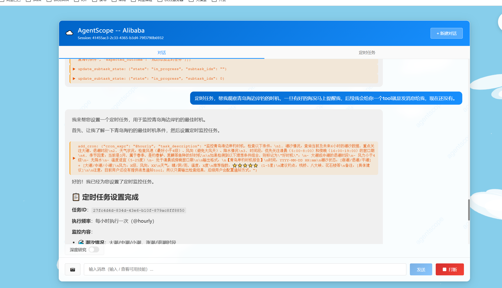
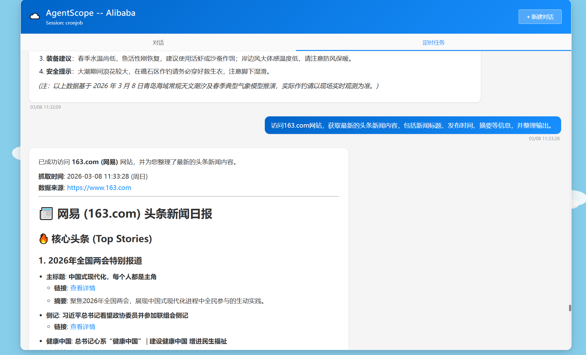
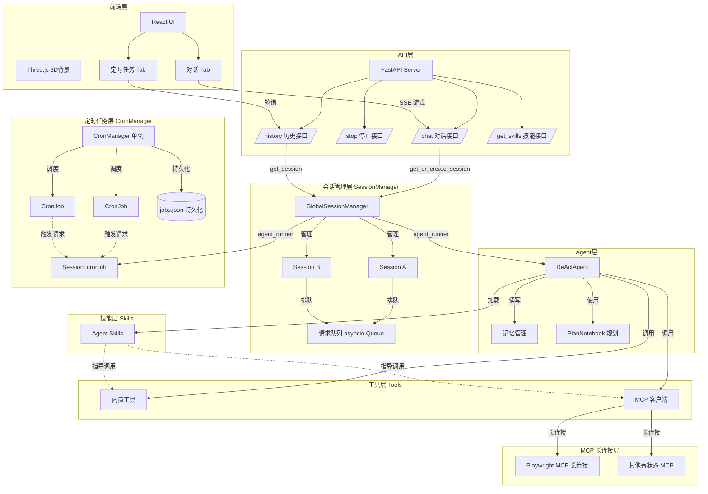

# AgentScope 小龙虾

[](https://github.com/owenliang/openclaw)
[](https://space.bilibili.com/288748846)





## 1. 技术栈

| 层级 | 技术 |
|------|------|
| 前端 | React 18 + Three.js (3D背景) |
| 后端 | FastAPI + AgentScope |
| AI 模型 | Qwen3-Max / Qwen3.5-Plus (DashScope) |
| 工具集成 | MCP (Model Context Protocol) |
| 会话存储 | JSON 文件持久化 |

## 2. 关键特性

- **ReAct 智能推理**：基于 AgentScope 的 ReActAgent 实现多步推理和工具调用
- **实时流式响应**：SSE 流式传输，支持打字机效果
- **多请求排队**：同一会话支持多个请求排队，自动顺序执行
- **真打断机制**：基于 request_id 的精准打断，可终止指定 SSE 请求
- **MCP 长连接**：有状态 MCP 客户端保持长连接，支持 Playwright 浏览器等
- **定时任务调度**：CronManager 统一管理定时任务，所有任务提交到专用 "cronjob" session 执行
- **工具调用生态**：
  - 内置工具：文件操作、Shell 命令、联网搜索、定时任务管理
  - MCP 集成：Playwright 浏览器、八字算命等外部服务
- **会话管理**：多会话隔离，支持长文本压缩和记忆恢复
- **深度研究模式**：Agentic Planning 支持复杂任务拆解
- **技能插件系统**：可扩展的 Skill 架构，Skill 指导 Tool 调用

## 3. 技术架构图


```mermaid
graph TB
    subgraph "前端层"
        UI[React UI]
        ThreeJS[Three.js 3D背景]
        TabChat[对话 Tab]
        TabCron[定时任务 Tab]
        UI --> TabChat
        UI --> TabCron
    end

    subgraph "API层"
        FastAPI[FastAPI Server]
        ChatEP[/chat 对话接口/]
        StopEP[/stop 停止接口/]
        HistoryEP[/history 历史接口/]
        SkillsEP[/get_skills 技能接口/]
        FastAPI --> ChatEP
        FastAPI --> StopEP
        FastAPI --> HistoryEP
        FastAPI --> SkillsEP
    end

    subgraph "会话管理层 SessionManager"
        SessionMgr[GlobalSessionManager]
        ReqQueue[请求队列 asyncio.Queue]
        Session1[Session A]
        Session2[Session B]
        SessionMgr -->|管理| Session1
        SessionMgr -->|管理| Session2
        Session1 -->|排队| ReqQueue
        Session2 -->|排队| ReqQueue
    end

    subgraph "Agent层"
        ReAct[ReActAgent]
        Memory[记忆管理]
        Plan[PlanNotebook 规划]
    end

    subgraph "技能层 Skills"
        Skills[Agent Skills]
    end

    subgraph "工具层 Tools"
        BuiltIn[内置工具]
        MCP[MCP 客户端]
    end

    subgraph "MCP 长连接层"
        MCPState1[Playwright MCP 长连接]
        MCPState2[其他有状态 MCP]
    end

    subgraph "定时任务层 CronManager"
        CronMgr[CronManager 单例]
        CronJob1[CronJob]
        CronJob2[CronJob]
        CronSession[Session: cronjob]
        CronPersistence[(jobs.json 持久化)]
        CronMgr -->|调度| CronJob1
        CronMgr -->|调度| CronJob2
        CronMgr -->|持久化| CronPersistence
        CronJob1 -.->|触发请求| CronSession
        CronJob2 -.->|触发请求| CronSession
    end

    TabChat -->|SSE 流式| ChatEP
    TabCron -->|轮询| HistoryEP
    ChatEP -->|get_or_create_session| SessionMgr
    HistoryEP -->|get_session| SessionMgr
    SessionMgr -->|agent_runner| ReAct
    SessionMgr -->|agent_runner| CronSession
    ReAct -->|加载| Skills
    ReAct -->|调用| BuiltIn
    ReAct -->|调用| MCP
    Skills -.->|指导调用| BuiltIn
    Skills -.->|指导调用| MCP
    ReAct -->|读写| Memory
    ReAct -->|使用| Plan
    MCP -->|长连接| MCPState1
    MCP -->|长连接| MCPState2
```

## 4. 定时任务功能

AgentScope 内置完整的定时任务调度系统，通过 `CronManager` 单例统一管理所有定时任务。

### 4.1 功能特性

| 特性 | 说明 |
|------|------|
| **秒级精度** | 支持 6 字段 cron 表达式（秒 分 时 日 月 周） |
| **持久化存储** | 任务自动保存到 `jobs.json`，重启后自动恢复 |
| **隔离执行** | 所有定时任务在专用 `cronjob` session 中执行 |
| **实时观察** | 前端「定时任务」Tab 实时查看执行历史和对话内容 |
| **自动滚动** | 新消息自动滚动到底部，支持手动回滚查看历史 |

### 4.2 Cron 表达式格式

支持标准 5 字段和扩展 6 字段格式：

| 格式 | 示例 | 说明 |
|------|------|------|
| 6 字段 | `*/30 * * * * *` | 每 30 秒执行 |
| 6 字段 | `0 */5 * * * *` | 每 5 分钟执行（整秒） |
| 5 字段 | `*/5 * * * *` | 每 5 分钟执行 |
| 特殊表达式 | `@hourly` | 每小时执行 |
| 特殊表达式 | `@daily` | 每天执行 |

### 4.3 相关工具

| 工具名称 | 功能 |
|---------|------|
| `add_cron` | 添加定时任务，支持秒级精度 |
| `del_cron` | 删除指定定时任务 |
| `list_crons` | 列出所有定时任务 |

## 5. 运行方法

### 环境准备

**Python 版本要求**：建议使用 Python 3.12 或以上版本（3.10 存在 asyncio bug [#45416](https://bugs.python.org/issue45416)）

```bash
# 1. 安装依赖
pip install -r requirements.txt

# 2. 配置环境变量
# 创建 .env 文件，填入：
DASHSCOPE_API_KEY=your_api_key_here
```

### 启动服务

```bash
# 启动后端服务
python server.py
```

服务启动后，访问 http://localhost:8000 即可使用。

### 内置工具列表

| 工具名称 | 功能描述 | 启用状态 |
|---------|---------|---------|
| view_text_file | 查看文本文件内容 | 默认启用 |
| write_text_file | 写入文本文件 | 默认启用 |
| insert_text_file | 在指定位置插入文本 | 默认启用 |
| execute_shell_command | 执行 Shell 命令 | 默认启用 |
| web_search | 联网搜索（支持图文混排） | 默认启用 |
| add_cron | 添加定时任务 | 默认启用 |
| del_cron | 删除定时任务 | 默认启用 |
| list_crons | 列出定时任务 | 默认启用 |
| subagent | 子代理委托 | 默认启用 |

### 内置技能列表

| 技能名称 | 功能描述 |
|---------|---------|
| find-skills | 帮助用户发现和安装 Agent Skills，支持通过 `npx skills` 命令搜索和安装社区技能 |
| python-code-review | Python 代码审查，检查类型安全、异步模式、错误处理和常见错误 |
| xlsx | Excel 文件处理，支持创建、编辑、分析 .xlsx/.csv 文件，包含公式重算和格式规范 |

### MCP 集成

| MCP 名称 | 类型 | 功能描述 |
|---------|------|---------|
| Playwright-MCP | 有状态/stdio | 浏览器自动化控制 |
| Bazi-MCP | 无状态/SSE | 八字算命服务 |

### API 接口列表

| 接口路径 | 方法 | 功能描述 |
|---------|------|---------|
| `/` | GET | 主页，返回 chat.html |
| `/chat` | POST | 对话接口，SSE 流式返回 |
| `/stop` | GET | 停止指定请求 |
| `/history` | GET | 获取会话历史记录 |
| `/get_skills` | GET | 获取可用技能列表 |
| `/get_commands` | GET | 获取可用命令/工具列表 |
| `/music/{filename}` | GET | 音乐文件服务 |

### 项目结构

```
.
├── server.py              # FastAPI 主服务
├── superagent.py          # Agent 核心逻辑 (ReActAgent)
├── tools.py               # 工具函数与注册
├── model.py               # 模型配置 (DashScope)
├── datamodel.py           # 数据模型定义
├── session.py             # 会话管理 (GlobalSessionManager)
├── cron_manager.py        # 定时任务管理 (CronManager 单例)
├── chat.html              # 前端页面 (React + Three.js)
├── cronjob.json           # 定时任务持久化文件
├── sessions/              # 会话状态存储目录
├── assets/
│   ├── image/             # 截图资源
│   │   ├── addcron.png    # 添加任务截图
│   │   └── listcron.png   # 任务列表截图
│   └── music/             # 音乐资源
└── .agents/skills/        # 技能插件目录
    ├── find-skills/
    ├── python-code-review/
    └── xlsx/
```
