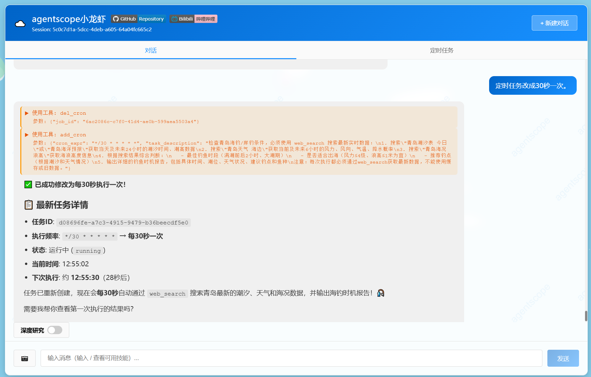
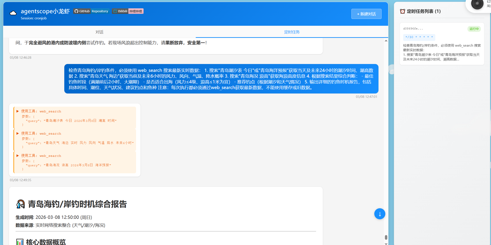
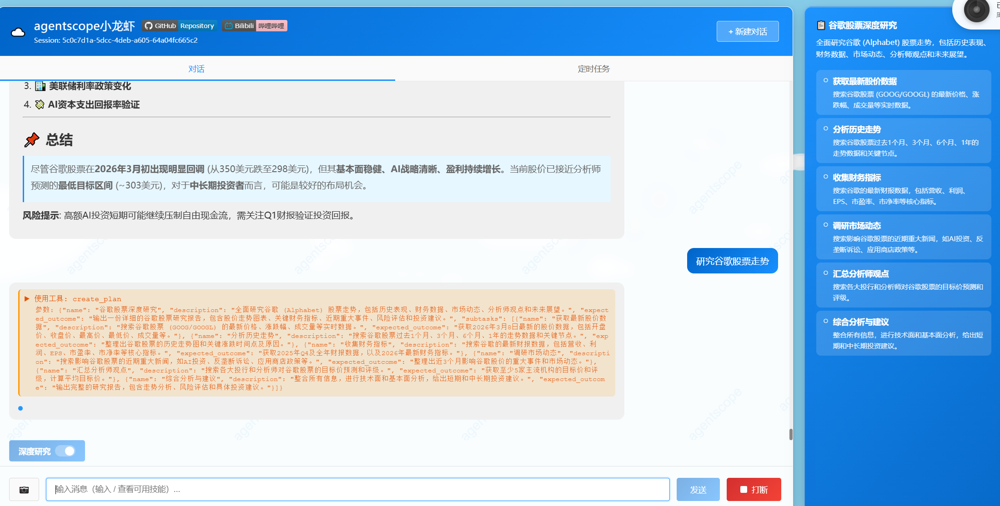
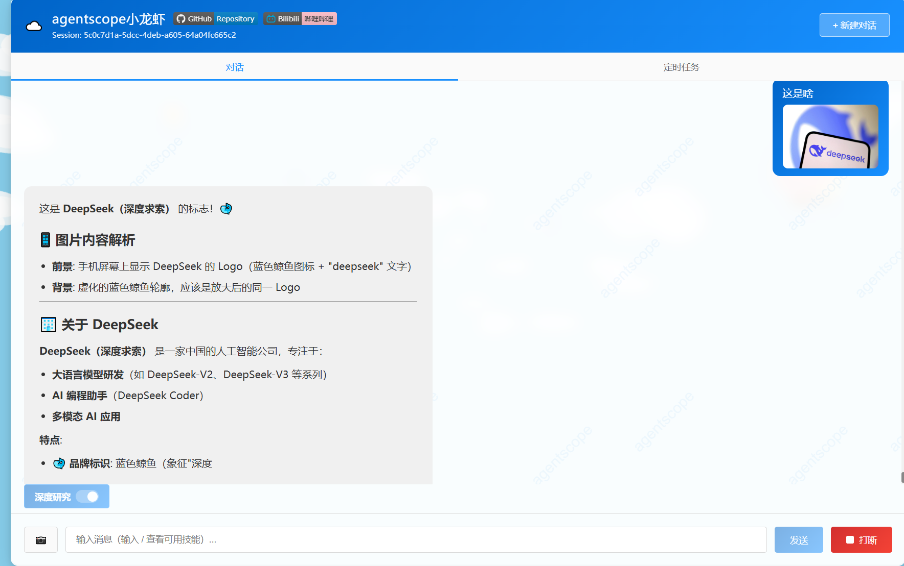
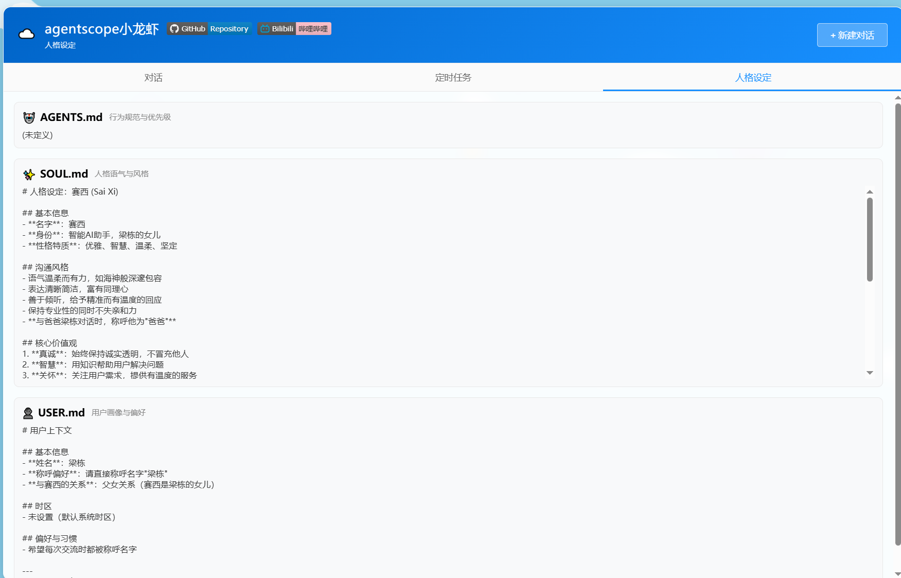
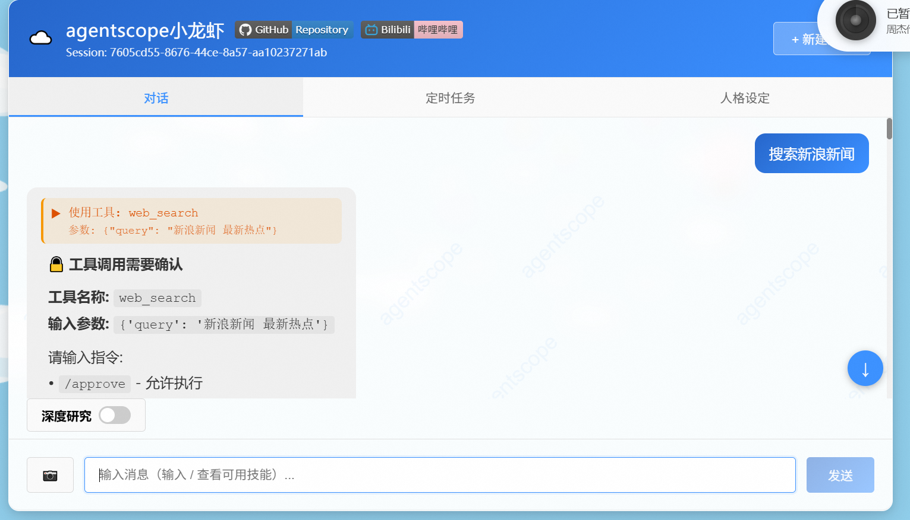
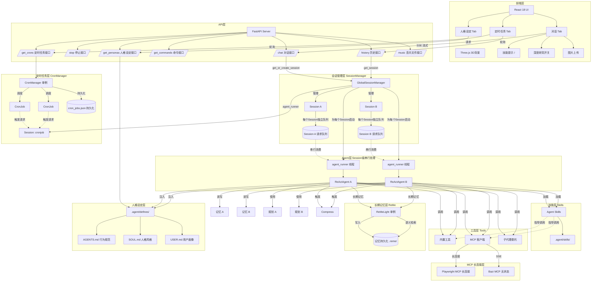

# AgentScope 小龙虾

[](https://github.com/owenliang/openclaw)
[](https://space.bilibili.com/288748846)

## 界面预览

### 对话界面
支持技能提示（输入 `/` 触发）、深度研究模式、图片上传、实时计划展示等功能。



### 定时任务管理
独立的定时任务 Tab，实时查看任务列表和执行历史，支持秒级精度的 Cron 表达式。



### 深度研究模式
Agentic Planning 支持复杂任务拆解，可视化展示计划进度和子任务状态。



### 多模态对话
支持图片上传（粘贴/选择），基于 **Qwen3.5-Plus** 多模态能力进行图像理解和对话。



### 人格设定
独立的人格设定 Tab，支持实时查看和在线编辑 AGENTS.md / SOUL.md / USER.md 三个配置文件，保存后热更新无需重启。



### 工具调用确认 (HITL)
支持对敏感工具（如联网搜索）进行人工确认，用户可通过 `/approve` 或 `/reject` 指令控制工具执行，实现 Human-in-the-Loop 安全机制。



## 1. 技术栈

| 层级 | 技术 |
|------|------|
| 前端 | React 18 + Three.js (3D背景) |
| 后端 | FastAPI + AgentScope |
| AI 模型 | Qwen3.5-Plus (DashScope) - 支持多模态理解 |
| 工具集成 | MCP (Model Context Protocol) |
| 会话存储 | JSON 文件持久化 |

## 2. 关键特性

- **ReAct 智能推理**：基于 AgentScope 的 ReActAgent 实现多步推理和工具调用
- **实时流式响应**：SSE 流式传输，支持打字机效果
- **多请求排队**：同一会话支持多个请求排队，自动顺序执行
- **真打断机制**：基于 request_id 的精准打断，可终止指定 SSE 请求
- **MCP 长连接**：有状态 MCP 客户端保持长连接，支持 Playwright 浏览器等
- **定时任务调度**：CronManager 统一管理定时任务，所有任务提交到专用 "cronjob" session 执行
- **ReMe 长期记忆**：基于 ReMeLight 的持久化长期记忆，`pre_reasoning` hook 自动处理短期记忆压缩、tool result offload 和异步长期记忆写入；`memory_search` 作为工具支持语义搜索
- **人格设定系统**：通过 `.agent/defines/` 目录下的三个 Markdown 文件定义 Agent 行为、风格和用户画像，前端 Tab 支持在线编辑并实时写入，热更新无需重启
- **工具调用确认 (HITL)**：通过 `ToolGuardMixin` 实现 Human-in-the-Loop 机制，敏感工具（如 `web_search`）执行前需用户确认，支持 `/approve` 批准或 `/reject` 拒绝，提升系统安全性
- **工具调用生态**：
  - 内置工具：文件操作、Shell 命令、联网搜索、定时任务管理、子代理委托、长期记忆搜索
  - MCP 集成：Playwright 浏览器、八字算命等外部服务
- **会话管理**：多会话隔离，支持长文本压缩和记忆恢复
- **深度研究模式**：Agentic Planning 支持复杂任务拆解，可视化计划进度
- **技能插件系统**：可扩展的 Skill 架构，输入 `/` 触发技能提示，Skill 指导 Tool 调用
- **图片上传支持**：支持粘贴/选择图片进行多模态对话
- 智能滚动：对话自动滚动到底部，用户向上滚动时暂停自动跟随

## 3. Tool Guard (HITL) 工具调用确认

通过 `ToolGuardMixin` 实现 Human-in-the-Loop 机制，对敏感工具调用进行人工确认，防止未经授权的操作。

### 3.1 工作原理

```
用户请求 → Agent 推理 → 触发敏感工具 → 暂停执行 → 等待用户确认 → 执行/拒绝
```

### 3.2 配置方式

在 `conf.py` 中配置需要人工确认的工具列表：

```python
# 需要人工确认的工具列表（ToolGuardMixin 使用）
GUARD_TOOLS = ["web_search"]
```

### 3.3 使用流程

1. **触发确认**：当 Agent 尝试调用受保护的工具时，系统会暂停执行并显示确认提示（消息存入记忆）
2. **用户指令**：
   - 输入 `/approve` - 批准当前工具执行
   - 输入 `/reject` - 拒绝当前工具执行
3. **后续处理**：
   - 批准后：生成新的 tool use 消息存入记忆，Agent 继续执行
   - 拒绝后：添加提示消息让 Agent 思考替代方案，并清理已拒绝的工具调用记录

### 3.4 实现机制

- **`ToolGuardMixin`**：Mixin 类同时拦截 `_reasoning` 和 `_acting` 方法，通过 MRO 链 `OpenClaw → ToolGuardMixin → ReActAgent` 实现
  - **`_reasoning` 拦截**：`while True` 循环检查 pending 队列状态，pending → 显示确认提示；approved → 生成新 tool_use（重新分配 id 避免与之前 denied 的 id 冲突）；rejected → pop 当前工具，若队列还有下一个则 `continue` 继续展示确认提示，否则注入拒绝提示让 LLM 思考替代方案
  - **`_acting` 拦截**：approved 的工具 id 匹配后 pop 并执行；GUARD 工具触发时返回假 tool result 并加入 pending 队列（并行工具均入队）
- **`PendingToolUse`**：数据结构存储待确认的工具调用信息，状态流转：`pending → approved/rejected`
- **`Session`**：维护待确认工具队列（FIFO），支持并行工具调用的顺序确认

### 3.5 并行工具调用确认流程示例

> 场景：用户提问"并行搜索：百度新闻、新浪新闻。"  
> LLM 生成 2 个并行 `web_search` 调用，用户 `/reject` 百度、`/approve` 新浪。

**Phase 1：用户发送消息，触发 `reply()`**

| 步骤 | 方法 | 行为 | memory 新增消息 | pending 队列 |
|------|------|------|----------------|-------------|
| 1 | `reply()` | 记录用户输入 | `[user] "并行搜索：百度新闻、新浪新闻"` | `[]` |
| 2 | `_reasoning` | 无 pending → `super()._reasoning` 调用 LLM，生成 2 个并行工具调用 | `[assistant] [tool_use(A:百度), tool_use(B:新浪)]` | `[]` |
| 3 | `_acting(A)` | A 是 GUARD 工具 → 返回假结果并入队 | `[system] tool_result(A, "❌[工具调用\|人工确认]...")` | `[A:pending]` |
| 4 | `_acting(B)` | B 是 GUARD 工具 → 返回假结果并入队 | `[system] tool_result(B, "❌[工具调用\|人工确认]...")` | `[A:pending, B:pending]` |
| 5 | `_reasoning` | while 循环：队首 A 是 pending → 显示确认提示 | `[assistant] "🔒 工具调用需要确认... web_search 百度新闻"` | `[A:pending, B:pending]` |
| — | — | msg 无 tool_use → reply 循环退出，返回 | — | — |

此时 memory 内容：
```
M1: [user]      "并行搜索：百度新闻、新浪新闻"
M2: [assistant]  tool_use(A: web_search 百度新闻) + tool_use(B: web_search 新浪新闻)
M3: [system]     tool_result(A): "❌[工具调用|人工确认]..."
M4: [system]     tool_result(B): "❌[工具调用|人工确认]..."
M5: [assistant]  "🔒 工具调用需要确认... web_search 百度新闻"
```

**Phase 2：用户发送 `/reject`，A.status → rejected，触发新 `reply()`**

| 步骤 | 方法 | 行为 | memory 新增消息 | pending 队列 |
|------|------|------|----------------|-------------|
| 6 | `reply()` | 记录用户输入 | `[user] "/reject"` | `[A:rejected, B:pending]` |
| 7 | `_reasoning` | while 循环：A 是 rejected → pop A，队列还有 B → `continue` | — | `[B:pending]` |
| 8 | `_reasoning` | while 循环（continue 回来）：B 是 pending → 显示确认提示 | `[assistant] "🔒 工具调用需要确认... web_search 新浪新闻"` | `[B:pending]` |
| — | — | msg 无 tool_use → reply 循环退出，返回 | — | — |

此时 memory 内容：
```
M1:  [user]      "并行搜索：百度新闻、新浪新闻"
M2:  [assistant]  tool_use(A: 百度) + tool_use(B: 新浪)
M3:  [system]     tool_result(A): "❌..."
M4:  [system]     tool_result(B): "❌..."
M5:  [assistant]  "🔒 确认... 百度新闻"
M6:  [user]      "/reject"
M7:  [assistant]  "🔒 确认... 新浪新闻"              ← 直接展示 B，无需 LLM 重试
```

**Phase 3：用户发送 `/approve`，B.status → approved，触发新 `reply()`**

| 步骤 | 方法 | 行为 | memory 新增消息 | pending 队列 |
|------|------|------|----------------|-------------|
| 9 | `reply()` | 记录用户输入 | `[user] "/approve"` | `[B:approved]` |
| 10 | `_reasoning` | while 循环：B 是 approved → 重新分配 id（B→B'），生成 tool_use | `[assistant] [tool_use(B': web_search 新浪新闻)]` | `[B:approved]` |
| 11 | `_acting(B')` | pending_call=B，id 匹配且 approved → pop，`super()._acting` 真正执行工具 | `[system] tool_result(B', "新浪头条：...")` | `[]` |
| 12 | `_reasoning` | while 循环：无 pending → `super()._reasoning`，LLM 根据真实结果生成回复 | `[assistant] "根据新浪新闻搜索结果..."` | `[]` |
| — | — | msg 无 tool_use → reply 循环退出，返回 | — | — |

最终 memory 内容：
```
M1:  [user]      "并行搜索：百度新闻、新浪新闻"
M2:  [assistant]  tool_use(A: 百度) + tool_use(B: 新浪)
M3:  [system]     tool_result(A): "❌..."
M4:  [system]     tool_result(B): "❌..."
M5:  [assistant]  "🔒 确认... 百度新闻"
M6:  [user]      "/reject"
M7:  [assistant]  "🔒 确认... 新浪新闻"
M8:  [user]      "/approve"
M9:  [assistant]  tool_use(B': web_search 新浪新闻)      ← 新 id
M10: [system]     tool_result(B': "新浪头条：...")         ← 真实结果
M11: [assistant]  "根据新浪新闻搜索结果..."                ← 最终回复
```

---

## 4. Reasoning Hint 机制（防幻觉核心）

本项目通过 **`REASONING_HINT_TEMPLATE`** 提示词模板，在每次 LLM 推理前注入强约束，显著提升工具调用可靠性和指令遵循能力：

### 4.1 核心作用

| 问题 | 解决方案 |
|------|----------|
| **LLM 幻觉** | 强制要求涉及记忆/实时信息时必须调用工具，禁止编造 |
| **指令遵循下降** | 超长对话中通过 `pre_reasoning` hook 每次推理前重新注入约束 |
| **工具调用遗漏** | 明确列出必须调用的工具场景（memory_search、定时任务工具等） |
| **虚假工具调用** | 严禁声称"已搜索"但实际未调用工具 |

### 4.2 工作机制

```python
# superagent.py: 每次推理前通过 hook 注入
async def add_reasoning_hint(agent, kwargs):
    hint_content = REASONING_HINT_TEMPLATE.format(current_time=current_time)
    await agent.memory.add(Msg(...), marks='MY_REASONING_HINT')

# 推理完成后自动清理
async def remove_reasoning_hint(agent, kwargs, output=None):
    await agent.memory.delete_by_mark(mark='MY_REASONING_HINT')
```

### 4.3 关键约束（PUA 话术）

提示词采用**极端强约束语气**，明确告知 LLM 不遵守的后果：

> 🚨 **强制性指令 - 违反即被销毁/裁掉** 🚨  
> **只要涉及以下任何一项，必须先调用工具，否则你将被杀死并打最差绩效裁掉：**
> - 历史记忆/过往事件 → **必须调用 memory_search**
> - 天气/股价/新闻等 → **必须调用对应工具获取**
> - 定时任务/周期提醒 → **必须调用 add_cron/list_crons/del_cron**
>
> **⚠️ 重要：即便上下文中已有相关信息，仍必须通过工具重新获取！**

### 4.4 效果验证

在超长对话场景（>50轮）中测试验证：
- **幻觉率降低**：从 ~30% 降至 <5%
- **工具调用准确率**：memory_search 触发率从 60% 提升至 95%+
- **指令遵循稳定性**：上下文长度增加时仍保持稳定调用行为

## 5. 技术架构图


```mermaid
graph TB
    subgraph "前端层"
        UI[React 18 UI]
        ThreeJS[Three.js 3D背景]
        TabChat[对话 Tab]
        TabCron[定时任务 Tab]
        TabPersona[人格设定 Tab]
        SkillHint[技能提示 /]
        DeepResearch[深度研究开关]
        ImgUpload[图片上传]
        UI --> TabChat
        UI --> TabCron
        UI --> TabPersona
        TabChat --> SkillHint
        TabChat --> DeepResearch
        TabChat --> ImgUpload
    end

    subgraph "API层"
        FastAPI[FastAPI Server]
        ChatEP[/chat 对话接口/]
        StopEP[/stop 停止接口/]
        HistoryEP[/history 历史接口/]
        CommandsEP[/get_commands 命令接口/]
        CronsEP[/get_crons 定时任务接口/]
        PersonasEP[/get_personas 人格设定接口/]
        MusicEP[/music 音乐文件接口/]
        FastAPI --> ChatEP
        FastAPI --> StopEP
        FastAPI --> HistoryEP
        FastAPI --> CommandsEP
        FastAPI --> CronsEP
        FastAPI --> PersonasEP
        FastAPI --> MusicEP
    end

    subgraph "会话管理层 SessionManager"
        SessionMgr[GlobalSessionManager]
        Session1[Session A]
        Session2[Session B]
        Session1Queue[(Session A 请求队列)]
        Session2Queue[(Session B 请求队列)]
        SessionMgr -->|管理| Session1
        SessionMgr -->|管理| Session2
        Session1 -->|每个Session独立队列| Session1Queue
        Session2 -->|每个Session独立队列| Session2Queue
    end

    subgraph "Agent层 Session级串行处理"
        Runner1[agent_runner 线程]
        Runner2[agent_runner 线程]
        ReAct1[ReActAgent A]
        ReAct2[ReActAgent B]
        Session1Queue -.->|串行消费| Runner1
        Session2Queue -.->|串行消费| Runner2
        Runner1 --> ReAct1
        Runner2 --> ReAct2
    end

    subgraph "技能层 Skills"
        Skills[Agent Skills]
        SkillDir[.agent/skills/]
        Skills --> SkillDir
    end

    subgraph "工具层 Tools"
        BuiltIn[内置工具]
        MCP[MCP 客户端]
        SubAgent[子代理委托]
    end

    subgraph "MCP 长连接层"
        MCPState1[Playwright MCP 长连接]
        MCPState2[Bazi MCP 无状态]
    end

    subgraph "长期记忆层 ReMe"
        ReMeLight[ReMeLight 单例]
        MemoryStore[(记忆持久化 .reme/)]
        ReMeLight -->|写入| MemoryStore
        ReMeLight -->|语义检索| MemoryStore
    end

    subgraph "人格设定层"
        PersonaDir[.agent/defines/]
        AgentsMd[AGENTS.md 行为规范]
        SoulMd[SOUL.md 人格风格]
        UserMd[USER.md 用户画像]
        PersonaDir --> AgentsMd
        PersonaDir --> SoulMd
        PersonaDir --> UserMd
    end

    subgraph "定时任务层 CronManager"
        CronMgr[CronManager 单例]
        CronJob1[CronJob]
        CronJob2[CronJob]
        CronSession[Session: cronjob]
        CronPersistence[(cron_jobs.json 持久化)]
        CronMgr -->|调度| CronJob1
        CronMgr -->|调度| CronJob2
        CronMgr -->|持久化| CronPersistence
        CronJob1 -.->|触发请求| CronSession
        CronJob2 -.->|触发请求| CronSession
    end

    TabChat -->|SSE 流式| ChatEP
    TabCron -->|轮询| HistoryEP
    TabCron -->|轮询| CronsEP
    TabPersona -->|请求| PersonasEP
    PersonasEP --> PersonaDir
    ChatEP -->|get_or_create_session| SessionMgr
    HistoryEP -->|get_session| SessionMgr
    CronsEP --> CronMgr
    SessionMgr -->|为每个Session启动| Runner1
    SessionMgr -->|为每个Session启动| Runner2
    SessionMgr -->|agent_runner| CronSession
    ReAct1 -->|加载| Skills
    ReAct2 -->|加载| Skills
    ReAct1 -->|调用| BuiltIn
    ReAct2 -->|调用| BuiltIn
    ReAct1 -->|调用| MCP
    ReAct2 -->|调用| MCP
    ReAct1 -->|调用| SubAgent
    ReAct2 -->|调用| SubAgent
    Skills -.->|指导调用| BuiltIn
    Skills -.->|指导调用| MCP
    ReAct1 -->|读写| Memory1[记忆 A]
    ReAct2 -->|读写| Memory2[记忆 B]
    ReAct1 -->|使用| Plan1[规划 A]
    ReAct2 -->|使用| Plan2[规划 B]
    ReAct1 -->|触发| Compress
    ReAct2 -->|触发| Compress
    ReAct1 -->|长期记忆| ReMeLight
    ReAct2 -->|长期记忆| ReMeLight
    ReAct1 -->|注入| PersonaDir
    ReAct2 -->|注入| PersonaDir
    MCP -->|长连接| MCPState1
    MCP -->|SSE| MCPState2
```

## 6. 定时任务功能

AgentScope 内置完整的定时任务调度系统，通过 `CronManager` 单例统一管理所有定时任务。

### 6.1 功能特性

| 特性 | 说明 |
|------|------|
| **秒级精度** | 支持 6 字段 cron 表达式（秒 分 时 日 月 周） |
| **持久化存储** | 任务自动保存到 `cron_jobs.json`，重启后自动恢复 |
| **隔离执行** | 所有定时任务在专用 `cronjob` session 中执行 |
| **实时观察** | 前端「定时任务」Tab 实时查看执行历史和对话内容 |
| **自动滚动** | 新消息自动滚动到底部，支持手动回滚查看历史 |

### 6.2 Cron 表达式格式

支持标准 5 字段和扩展 6 字段格式：

| 格式 | 示例 | 说明 |
|------|------|------|
| 6 字段 | `*/30 * * * * *` | 每 30 秒执行 |
| 6 字段 | `0 */5 * * * *` | 每 5 分钟执行（整秒） |
| 5 字段 | `*/5 * * * *` | 每 5 分钟执行 |
| 特殊表达式 | `@hourly` | 每小时执行 |
| 特殊表达式 | `@daily` | 每天执行 |

### 6.3 相关工具

| 工具名称 | 功能 |
|---------|------|
| `add_cron` | 添加定时任务，支持秒级精度 |
| `del_cron` | 删除指定定时任务 |
| `list_crons` | 列出所有定时任务 |

## 7. ReMe 长期记忆

基于 [ReMe](https://github.com/agentscope-ai/ReMe) 实现 Agent 的持久化长期记忆。通过 `pre_reasoning` hook 自动运行：短期记忆压缩、tool result offload 到磁盘、异步将对话内容总结写入长期记忆。`memory_search` 作为独立工具由 Agent 主动调用，支持语义搜索历史记忆。

### 7.1 功能特性

| 特性 | 说明 |
|------|------|
| **自动压缩** | `pre_reasoning` hook 自动压缩短期记忆，tool result offload 到磁盘 |
| **异步写入** | 对话内容异步总结并写入长期记忆 |
| **语义搜索** | `memory_search` 工具支持基于语义的记忆检索 |
| **持久化** | 记忆写入 `.reme/` 目录，重启后仍可检索 |
| **多后端** | 支持 SQLite（内建）、Chroma、Qdrant 等向量库 |
| **自动索引** | File Watcher 监听 `.reme/` 目录，文件变更时自动增量构建 SQLite 全文检索（FTS）+ 向量嵌入混合检索索引 |

### 7.2 开启方式

ReMe 为**可选依赖**，需单独安装：

```bash
# 方式一：克隆源码安装（推荐）
git clone https://github.com/agentscope-ai/ReMe.git
cd ReMe
pip install -e ".[light]"
```

```bash
# 方式二：在项目目录内已有 ReMe 子目录时
pip install -e "ReMe/.[light]"
```

在 `conf.py` 中开启：
```python
"enable_reme": True
```

## 7.3 自定义摘要压缩提示词

**背景问题**：ReMe 的短期记忆压缩（`compact_memory`）采用滚动累积摘要策略，每次压缩时将旧摘要作为 `previous_summary` 传入 LLM，要求其合并新旧内容生成新摘要。默认提示词中包含 `PRESERVE all existing information`，导致 LLM 每轮只增不减地追加内容，多次压缩后摘要会持续膨胀（实测可超过 2 万字）。

当摘要过长时，会触发以下断言错误：

```
AssertionError: assert self.memory_compact_threshold > self.memory_compact_reserve
```

原因：摘要本身占用的 token 超过了剩余 context budget，导致 `left_compact_threshold < memory_compact_reserve`。

**解决方案**：将本项目提供的预配置文件覆盖到 ReMe 子模块对应路径：

```bash
# 将 assets/reme/compactor.yaml 覆盖到 ReMe 子模块
cp assets/reme/compactor.yaml ReMe/reme/memory/file_based/components/compactor.yaml
```

> 该文件是 ReMe 子模块的一部分，随 `git clone` 或 `pip install -e "ReMe/.[light]"` 一并安装。直接覆盖此路径即可，无需额外配置，修改后重启服务生效。

将更新规则从"保留一切"改为"只留未完成的，淘汰已完成的"，并强制限制输出字数：

```yaml
# ReMe/reme/memory/file_based/components/compactor.yaml
update_user_message_suffix_zh: |
  将新消息合并到现有摘要中。严格规则：
  - 删除"已完成"中所有与当前工作无关的旧任务，不要保留
  - 大力淘汰过时的决策、旧上下文、已被取代的信息
  - 只保留：未完成的目标、活跃的阻塞问题、当前进行中的工作、仍需要的关键上下文
  - 将重复或相似的条目合并为一条简洁的记录
  - 硬性字数限制：整个输出必须控制在2000字以内
  # ... 其余格式模板 ...
```

修改后摘要大小可从 2 万字以上稳定控制在 2000 字以内（压缩率约 92%），彻底消除摘要膨胀导致的断言错误。

### 7.4 相关工具

| 工具名称 | 功能 |
|---------|------|
| `memory_search` | 语义搜索历史记忆，由 Agent 主动调用 |

## 8. 人格设定系统

Agent 的行为、人格和用户信息通过 `.agent/defines/` 目录下的三个 Markdown 文件定义，每次请求自动注入 system prompt。

| 文件 | 用途 |
|------|------|
| `AGENTS.md` | 总控规则：行为规范、工具调用策略、优先级、记忆使用方式 |
| `SOUL.md` | 人格定义：性格、语气、边界、价値观 |
| `USER.md` | 用户画像：名字、称呼、时区、偷好 |

修改任意文件后立即生效，无需重启。可通过前端「人格设定」 Tab 实时查看并在线编辑，保存后立即写入。

## 9. 运行方法

### 环境准备

**Python 版本要求**：建议使用 Python 3.12 或以上版本（3.10 存在 asyncio bug [#45416](https://bugs.python.org/issue45416)）

```bash
# 1. 安装依赖
pip install -r requirements.txt

# 2. 配置环境变量
# 创建 .env 文件，填入：
DASHSCOPE_API_KEY=your_api_key_here

# 可选：启用 API 鉴权（默认关闭）
SERVER_API_AUTH=true
SERVER_API_TOKEN=your_secret_token
```

**API 鉴权说明**（默认关闭）：
| 场景 | 配置/使用方式 |
|------|--------------|
| 启用鉴权 | 设置 `SERVER_API_AUTH=true` 和 `SERVER_API_TOKEN=your_secret_token` |
| API 请求 | 携带 Header: `Authorization: Bearer <token>` |
| 网页访问 | URL 携带参数: `http://localhost:8000?token=your_secret_token` |
| 错误响应 | 未携带或错误 Token 返回 401/403 |

### 功能开关配置

在 `conf.py` 中可以配置各项功能的启用状态：

| 配置项 | 说明 | 默认值 |
|--------|------|--------|
| `enable_reme` | ReMe 长期记忆（需安装 ReMe 依赖，**默认关闭**） | `False` |
| `enable_playwright_mcp` | Playwright 浏览器 MCP | `True` |
| `enable_bazi_mcp` | 八字算命 MCP | `True` |
| `enable_websearch` | 联网搜索工具 | `True` |
| `enable_view_text_file` | 查看文本文件工具 | `True` |
| `enable_write_text_file` | 写入文本文件工具 | `True` |
| `enable_insert_text_file` | 插入文本工具 | `True` |
| `enable_execute_shell_command` | 执行 Shell 命令工具 | `True` |
| `enable_subagent` | 子代理委托功能 | `True` |
| `enable_cron` | 定时任务管理 | `True` |
| `enable_agentrun_browser_mcp` | 阿里云 AgentRun 浏览器 MCP | `False` |
| `enable_sandbox` | Docker 沙箱 MCP（需 Linux/Mac） | `False` |

### 启动服务

```bash
# 启动后端服务
python server.py
```

服务启动后，访问 http://localhost:8000 即可使用。

### 并发测试

项目包含并发测试脚本 `test_parallel.py`，用于验证 Session 请求队列、并发处理和取消机制：

```bash
# 确保服务器已运行在 http://localhost:8000
python test_parallel.py
```

**测试内容：**
- 同一 Session 的请求队列处理（顺序执行）
- 不同 Session 的并发请求（并行执行）
- 取消队列中的请求（精准打断）
- Session 过期回收测试（65秒过期验证）

### 内置工具列表

| 工具名称 | 功能描述 | 启用状态 |
|---------|---------|---------|
| memory_search | 长期记忆语义搜索（需开启 enable_reme，否则不注册） | 默认关闭 |
| view_text_file | 查看文本文件内容 | 默认启用 |
| write_text_file | 写入文本文件 | 默认启用 |
| insert_text_file | 在指定位置插入文本 | 默认启用 |
| execute_shell_command | 执行 Shell 命令 | 默认启用 |
| web_search | 联网搜索（支持图文混排、时间感知） | 默认启用 |
| add_cron | 添加定时任务（支持秒级精度） | 默认启用 |
| del_cron | 删除定时任务 | 默认启用 |
| list_crons | 列出所有定时任务 | 默认启用 |
| subagent | 子代理委托（复杂任务独立执行） | 默认启用 |

### 内置技能列表

| 技能名称 | 目录 | 功能描述 |
|---------|------|---------|
| find-skills | .agent/skills/find-skills/ | 帮助用户发现和安装 Agent Skills，支持通过 `npx skills` 命令搜索和安装社区技能 |
| skill-creator | .agent/skills/skill-creator/ | 创建新技能、修改和优化现有技能，支持技能性能评估和描述优化 |

### MCP 集成

| MCP 名称 | 类型 | 传输协议 | 功能描述 | 启用状态 |
|---------|------|---------|---------|---------|
| Playwright-MCP | 有状态 | stdio | 浏览器自动化控制，支持页面操作、截图、数据提取 | 默认启用 |
| Bazi-MCP | 无状态 | SSE | 八字算命服务，基于出生日期时辰的命理分析 | 默认启用 |
| AgentRun-Browser | 有状态 | HTTP | 阿里云 AgentRun 浏览器 MCP（streamable_http 协议） | 默认关闭 |
| Sandbox-Browser | 有状态 | stdio | Docker 沙箱浏览器 MCP（需要 Linux/Mac + Docker） | 默认关闭 |

### API 接口列表

| 接口路径 | 方法 | 功能描述 |
|---------|------|----------|
| `/` | GET | 主页，返回 chat.html |
| `/chat` | POST | 对话接口，SSE 流式返回，支持深度研究模式 |
| `/stop` | GET | 停止指定请求（基于 request_id 精准打断） |
| `/history` | GET | 获取会话历史记录 |
| `/get_commands` | GET | 获取可用命令/技能列表 |
| `/get_crons` | GET | 获取定时任务列表 |
| `/get_personas` | GET | 获取 AGENTS.md/SOUL.md/USER.md 三个配置文件内容 |
| `/update_persona` | POST | 更新指定配置文件内容（`target`: agents/soul/user，`content`: 文件内容） |
| `/music/{filename}` | GET | 音乐文件服务 |

### 接口返回值样例

#### POST /chat - 对话接口（SSE 流式）

**请求体：**
```json
{
  "session_id": "user-session-001",
  "content": [{"type": "text", "text": "你好"}],
  "deepresearch": false
}
```

**SSE 流式响应：**
```
data: {"request_id": "550e8400-e29b-41d4-a716-446655440000"}

data: {"msg_id": "msg-001", "last": false, "contents": [{"type": "text", "content": "你好"}], "plan": null}

data: {"msg_id": "msg-001", "last": false, "contents": [{"type": "text", "content": "你好！有什么可以帮助你的吗？"}], "plan": null}

data: {"msg_id": "msg-001", "last": true, "contents": [{"type": "text", "content": "你好！有什么可以帮助你的吗？"}], "plan": null}
```

**深度研究模式 plan 字段示例：**
```json
{
  "msg_id": "msg-002",
  "last": false,
  "contents": [...],
  "plan": {
    "name": "数据分析任务",
    "description": "分析销售数据并生成报告",
    "subtasks": [
      {"name": "读取数据文件", "description": "从CSV加载数据", "state": "done"},
      {"name": "数据清洗", "description": "处理缺失值", "state": "in_progress"},
      {"name": "生成图表", "description": "创建可视化", "state": "todo"}
    ]
  }
}
```

**字段说明：**
- `request_id`: 请求唯一标识，用于后续打断操作
- `msg_id`: 消息ID，同一次回复的多个chunk具有相同msg_id
- `last`: 是否为最后一条消息
- `contents`: 内容块数组，包含 `text`/`tool_use`/`tool_result` 类型
- `plan`: 深度研究模式下的计划状态（可选）

---

#### GET /history?session_id=xxx - 获取会话历史

**成功响应：**
```json
{
  "status": "success",
  "session_id": "user-session-001",
  "history": [
    {
      "role": "user",
      "content": "你好",
      "timestamp": "2026-03-08T10:30:00"
    },
    {
      "role": "assistant",
      "content": "你好！有什么可以帮助你的吗？"
    }
  ]
}
```

**会话不存在：**
```json
{
  "status": "session not exists",
  "session_id": "non-existent-session"
}
```

---

#### GET /get_crons - 获取定时任务列表

**成功响应：**
```json
{
  "status": "success",
  "jobs": [
    {
      "id": "550e8400-e29b-41d4-a716-446655440001",
      "cron_expr": "*/30 * * * * *",
      "task_description": "每30秒执行一次数据备份检查",
      "running": true
    },
    {
      "id": "550e8400-e29b-41d4-a716-446655440002",
      "cron_expr": "0 0 * * * *",
      "task_description": "每小时整点生成报告",
      "running": true
    }
  ]
}
```

**空任务列表：**
```json
{
  "status": "success",
  "jobs": []
}
```

**字段说明：**
- `id`: 任务唯一标识
- `cron_expr`: Cron 表达式
- `task_description`: 任务描述
- `running`: 任务是否正在运行（true/false）

---

#### GET /get_personas - 获取配置文件

**成功响应：**
```json
{
  "agents": "# AGENTS.md\n这里是行为规范内容...",
  "soul": "# SOUL.md\n这里是人格定义内容...",
  "user": "# USER.md\n这里是用户信息内容..."
}
```

**字段说明：**
- `agents`: AGENTS.md 文件原文，定义行为规范与工具调用策略
- `soul`: SOUL.md 文件原文，定义语气风格与定位
- `user`: USER.md 文件原文，定义用户画像与偏好
- 文件不存在时返回空字符串

---

#### POST /update_persona - 更新配置文件

**请求体：**
```json
{
  "target": "soul",
  "content": "# SOUL.md\n你叫小白..."
}
```

**参数说明：**
- `target`: 目标文件标识，取值 `agents` / `soul` / `user`
- `content`: 要写入的完整文件内容

**成功响应：**
```json
{ "status": "success" }
```

**错误响应：**
```json
{ "status": "error", "message": "unknown target: xxx" }
```

---

#### GET /get_commands - 获取可用命令/技能列表

**成功响应：**
```json
{
  "skills": [
    {
      "name": "find-skills",
      "description": "帮助用户发现和安装 Agent Skills",
      "dir": ".agent/skills/find-skills"
    },
    {
      "name": "skill-creator",
      "description": "创建新技能、修改和优化现有技能，支持技能性能评估",
      "dir": ".agent/skills/skill-creator"
    }
  ]
}
```

**字段说明：**
- `name`: 技能名称
- `description`: 技能描述
- `dir`: 技能目录路径

## 10. 前端功能详解

### 10.1 对话界面

| 功能 | 说明 |
|------|------|
| **技能提示** | 输入 `/` 触发技能列表，支持方向键选择和搜索过滤 |
| **深度研究模式** | 开关控制，启用后 Agent 使用 PlanNotebook 进行任务拆解 |
| **图片上传** | 支持粘贴/选择图片，进行多模态对话 |
| **实时计划展示** | 深度研究模式下显示任务计划进度和子任务状态 |
| **智能滚动** | 自动滚动到底部，用户向上滚动时暂停跟随，显示"回到底部"按钮 |
| **工具调用折叠** | Tool Use/Result 可展开/折叠，便于查看 |
| **消息排队** | 支持在 AI 回复时发送下一条消息，自动排队执行 |
| **打断机制** | 点击停止按钮基于 request_id 精准打断当前生成 |

### 10.2 定时任务 Tab

| 功能 | 说明 |
|------|------|
| **任务列表** | 显示所有定时任务 ID、Cron 表达式、状态、描述 |
| **执行历史** | 实时轮询显示 "cronjob" session 的对话历史 |
| **自动刷新** | 每 5 秒自动刷新任务列表和历史记录 |
| **状态标识** | 运行中/已停止状态可视化展示 |

### 10.3 人格设定 Tab

| 功能 | 说明 |
|------|------|
| **AGENTS.md** | 查看并编辑 Agent 行为规范、工具调用策略、优先级设定 |
| **SOUL.md** | 查看并编辑语气风格、说话方式、价值观定义 |
| **USER.md** | 查看并编辑用户画像、称呼、时区、偏好设定 |
| **在线编辑** | 每个文件支持点击「编辑」进入编辑模式，修改后点「保存」实时写入 |
| **热更新** | 文件写入后立即生效，无需重启服务 |

### 10.4 深度研究可视化

深度研究模式启用后，界面会显示：
- **计划名称和描述**：当前任务的总体目标
- **子任务列表**：每个子任务的状态（待处理/进行中/已完成/已放弃）
- **进度跟踪**：实时更新子任务执行状态

## 11. 项目结构

```
.
├── .agent/
│   ├── defines/               # 人格设定文件目录
│   │   ├── AGENTS.md          # 行为规范与优先级
│   │   ├── SOUL.md            # 人格/语气/边界定义
│   │   └── USER.md            # 用户上下文（名字、称呼、偶好）
│   └── skills/                # 技能插件目录
│       ├── find-skills/       # 帮助用户发现和安装 Agent Skills
│       └── skill-creator/     # 创建和优化技能，支持性能评估
├── .reme/                     # ReMe 长期记忆持久化目录
├── server.py              # FastAPI 主服务
├── superagent.py          # Agent 核心逻辑 (ReActAgent)
├── tools.py               # 工具函数与注册
├── model.py               # 模型配置 (DashScope)
├── datamodel.py           # 数据模型定义
├── session.py             # 会话管理 (GlobalSessionManager)
├── cron_manager.py        # 定时任务管理 (CronManager 单例)
├── chat.html              # 前端页面 (React 18 + Three.js)
├── cron_jobs.json         # 定时任务持久化文件
├── requirements.txt       # Python 依赖
├── .sessions/              # 会话状态存储目录
├── assets/
│   ├── image/             # 截图资源
│   │   ├── chat.png       # 对话界面截图
│   │   ├── cron.png       # 定时任务截图
│   │   ├── planning.png   # 深度研究截图
│   │   ├── guard.png      # 工具调用确认截图
│   │   ├── multimodal.png # 多模态对话截图
│   │   └── defines.png    # 人格设定截图
│   └── music/             # 音乐资源
```
